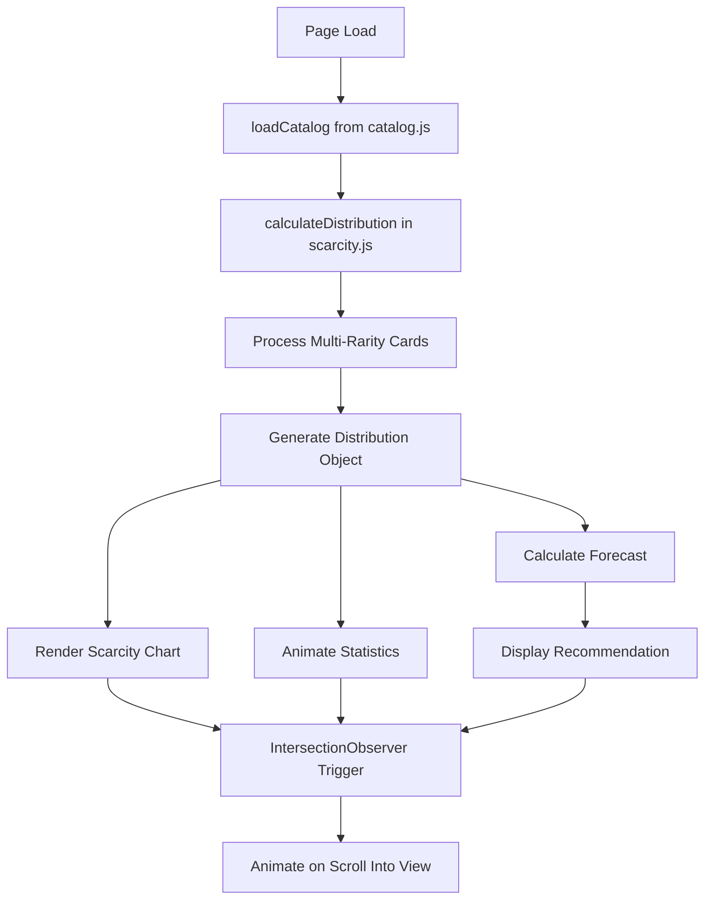

# Design Document

## Overview

The annotation scarcity visualization feature adds a new section to the Lumimenta website that displays the current distribution of annotation ink colors (blue, silver, gold) across all minted cards and provides intelligent forecasting for the next mint. The feature integrates seamlessly with the existing catalog system, reusing data loading mechanisms and following established design patterns for consistency.

The visualization consists of three main components:
1. **Scarcity Curve Chart** - A visual representation of rarity distribution
2. **Statistics Panel** - Detailed counts and percentages for each ink color
3. **Forecast Recommendation** - AI-driven suggestion for the next mint's ink color

This feature maintains the physical-first philosophy by treating the visualization as a tool for production planning rather than digital asset management.

## Architecture

### Component Structure

```
annotation-scarcity-visualization/
├── HTML Section (index.html)
│   ├── #scarcity-section
│   │   ├── .scarcity-header
│   │   ├── .scarcity-chart-container
│   │   │   └── .scarcity-chart (canvas or SVG)
│   │   ├── .scarcity-stats-grid
│   │   │   ├── .stat-card.blue
│   │   │   ├── .stat-card.silver
│   │   │   └── .stat-card.gold
│   │   └── .forecast-panel
│   │       ├── .forecast-recommendation
│   │       └── .forecast-rationale
│
├── JavaScript Module (js/scarcity.js)
│   ├── loadScarcityData()
│   ├── calculateDistribution()
│   ├── calculateForecast()
│   ├── renderScarcityChart()
│   ├── animateStatistics()
│   └── updateForecastPanel()
│
└── CSS Styles (css/style.css)
    ├── .scarcity-section
    ├── .scarcity-chart
    ├── .stat-card
    └── .forecast-panel
```

### Data Flow



### Integration Points

1. **Catalog Data Reuse**: The feature will import and use the existing `loadCatalog()` function from `catalog.js` to avoid duplicate network requests
2. **Rarity Calculation**: Extends the existing `calculateRarityDistribution()` function to handle multi-rarity cards correctly
3. **Design System**: Uses existing CSS custom properties for colors, spacing, and shadows
4. **Animation Framework**: Follows the same IntersectionObserver pattern used for statistics counters

## Components and Interfaces

### 1. Scarcity Data Module (js/scarcity.js)

#### Core Functions

```javascript
/**
 * Calculate annotation ink color distribution
 * @param {Array} cards - Array of card objects from catalog
 * @returns {Object} Distribution with counts and percentages
 */
function calculateDistribution(cards) {
    // Returns: { blue: {count, percentage}, silver: {count, percentage}, gold: {count, percentage}, total }
}

/**
 * Calculate forecast recommendation for next mint
 * @param {Object} distribution - Distribution object from calculateDistribution
 * @returns {Object} Forecast with recommended color and rationale
 */
function calculateForecast(distribution) {
    // Returns: { recommendedColor, rationale, balanceScore }
}

/**
 * Render scarcity curve visualization
 * @param {Object} distribution - Distribution object
 * @param {HTMLElement} container - Container element for chart
 */
function renderScarcityChart(distribution, container) {
    // Creates bar chart or donut chart visualization
}

/**
 * Animate statistics counters
 * @param {Object} distribution - Distribution object
 * @param {HTMLElement} container - Container for stat cards
 */
function animateStatistics(distribution, container) {
    // Animates count-up effect using requestAnimationFrame
}

/**
 * Update forecast panel with recommendation
 * @param {Object} forecast - Forecast object from calculateForecast
 * @param {HTMLElement} panel - Forecast panel element
 */
function updateForecastPanel(forecast, panel) {
    // Updates DOM with recommendation and rationale
}
```

#### Export Interface

```javascript
export {
    calculateDistribution,
    calculateForecast,
    renderScarcityChart,
    animateStatistics,
    updateForecastPanel
};
```

### 2. HTML Structure

The scarcity section will be added to `index.html` after the statistics section and before the availability grid:

```html
<!-- Annotation Scarcity Visualization -->
<section id="scarcity" class="scarcity-section" aria-labelledby="scarcity-heading">
    <div class="container">
        <h2 id="scarcity-heading" class="section-heading">Annotation Scarcity Analysis</h2>
        <p class="section-description">
            Visualize the distribution of annotation ink colors across all minted cards 
            and get intelligent recommendations for maintaining balanced rarity.
        </p>
        
        <!-- Scarcity Chart -->
        <div class="scarcity-chart-container" role="img" aria-label="Scarcity distribution chart">
            <canvas id="scarcity-chart" class="scarcity-chart"></canvas>
        </div>
        
        <!-- Statistics Grid -->
        <div class="scarcity-stats-grid" role="list">
            <div class="stat-card blue" role="listitem">
                <div class="stat-icon" aria-hidden="true">●</div>
                <div class="stat-label">Blue Annotations</div>
                <div class="stat-value" data-target="0">0</div>
                <div class="stat-percentage">0%</div>
            </div>
            
            <div class="stat-card silver" role="listitem">
                <div class="stat-icon" aria-hidden="true">●</div>
                <div class="stat-label">Silver Annotations</div>
                <div class="stat-value" data-target="0">0</div>
                <div class="stat-percentage">0%</div>
            </div>
            
            <div class="stat-card gold" role="listitem">
                <div class="stat-icon" aria-hidden="true">●</div>
                <div class="stat-label">Gold Annotations</div>
                <div class="stat-value" data-target="0">0</div>
                <div class="stat-percentage">0%</div>
            </div>
        </div>
        
        <!-- Forecast Panel -->
        <div class="forecast-panel" role="region" aria-labelledby="forecast-heading">
            <h3 id="forecast-heading" class="forecast-heading">Next Mint Recommendation</h3>
            <div class="forecast-recommendation">
                <span class="forecast-color-indicator" aria-hidden="true"></span>
                <span class="forecast-color-name">Calculating...</span>
            </div>
            <p class="forecast-rationale">Loading recommendation...</p>
        </div>
    </div>
</section>
```

### 3. CSS Styling

#### Layout and Responsive Design

```css
/* Scarcity Section */
.scarcity-section {
    padding: var(--spacing-3xl) 0;
    background: var(--color-bg-medium);
    border-top: 1px solid var(--color-border-dark);
}

.scarcity-chart-container {
    max-width: 800px;
    margin: var(--spacing-2xl) auto;
    padding: var(--spacing-lg);
    background: var(--color-bg-surface);
    border-radius: var(--radius-lg);
    backdrop-filter: blur(10px);
}

.scarcity-chart {
    width: 100%;
    height: 300px;
    display: block;
}

/* Statistics Grid */
.scarcity-stats-grid {
    display: grid;
    grid-template-columns: repeat(auto-fit, minmax(200px, 1fr));
    gap: var(--spacing-md);
    margin: var(--spacing-2xl) 0;
}

.stat-card {
    padding: var(--spacing-lg);
    background: var(--color-bg-surface);
    border-radius: var(--radius-lg);
    text-align: center;
    backdrop-filter: blur(10px);
    border: 2px solid transparent;
    transition: transform 0.3s ease, border-color 0.3s ease;
}

.stat-card:hover {
    transform: translateY(-4px);
}

.stat-card.blue {
    border-color: var(--color-primary);
}

.stat-card.silver {
    border-color: var(--color-secondary);
}

.stat-card.gold {
    border-color: var(--color-accent);
}

.stat-icon {
    font-size: 3em;
    margin-bottom: var(--spacing-sm);
}

.stat-card.blue .stat-icon {
    color: var(--color-primary);
}

.stat-card.silver .stat-icon {
    color: var(--color-secondary);
}

.stat-card.gold .stat-icon {
    color: var(--color-accent);
}

.stat-value {
    font-size: 2.5em;
    font-weight: bold;
    margin: var(--spacing-sm) 0;
}

.stat-percentage {
    font-size: 1.2em;
    color: var(--color-text-secondary);
}

/* Forecast Panel */
.forecast-panel {
    max-width: 600px;
    margin: var(--spacing-2xl) auto 0;
    padding: var(--spacing-xl);
    background: linear-gradient(135deg, rgba(74, 144, 226, 0.1), rgba(199, 159, 96, 0.1));
    border-radius: var(--radius-lg);
    border: 2px solid var(--color-border-light);
    text-align: center;
}

.forecast-recommendation {
    display: flex;
    align-items: center;
    justify-content: center;
    gap: var(--spacing-md);
    margin: var(--spacing-lg) 0;
}

.forecast-color-indicator {
    width: 40px;
    height: 40px;
    border-radius: 50%;
    display: inline-block;
    box-shadow: var(--shadow-medium);
}

.forecast-color-name {
    font-size: 2em;
    font-weight: bold;
}

.forecast-rationale {
    color: var(--color-text-secondary);
    line-height: 1.6;
}

/* Responsive Breakpoints */
@media (max-width: 768px) {
    .scarcity-stats-grid {
        grid-template-columns: 1fr;
    }
    
    .scarcity-chart {
        height: 250px;
    }
}

@media (max-width: 480px) {
    .scarcity-chart {
        height: 200px;
    }
    
    .forecast-color-name {
        font-size: 1.5em;
    }
}

/* Reduced Motion Support */
@media (prefers-reduced-motion: reduce) {
    .stat-card {
        transition: none;
    }
    
    .stat-card:hover {
        transform: none;
    }
}
```

## Data Models

### Distribution Object

```javascript
{
    blue: {
        count: 6,        // Total blue annotations
        percentage: 60.0 // Percentage of total
    },
    silver: {
        count: 2,
        percentage: 20.0
    },
    gold: {
        count: 2,
        percentage: 20.0
    },
    total: 10           // Total annotation count
}
```

### Forecast Object

```javascript
{
    recommendedColor: 'silver',  // 'blue', 'silver', or 'gold'
    rationale: 'Silver annotations are currently underrepresented at 20%. Minting with silver ink will help balance the distribution.',
    balanceScore: 0.73,          // 0-1 score indicating distribution balance
    currentGap: 4                // Difference between highest and lowest counts
}
```

### Multi-Rarity Card Handling

For cards with multiple rarities (e.g., `"rarity": ["gold", "silver"]`):
- Each rarity is counted separately in the distribution
- The card contributes to both gold and silver counts
- Total count reflects the sum of all rarity instances

Example:
```javascript
// Card with multi-rarity
{
    "id": 7,
    "rarity": ["gold", "silver"]
}

// Contributes to distribution as:
// gold.count += 1
// silver.count += 1
// total += 2
```

## Error Handling

### Network Errors

```javascript
async function loadScarcityData() {
    try {
        const cards = await loadCatalog();
        if (!cards || cards.length === 0) {
            throw new Error('No catalog data available');
        }
        return calculateDistribution(cards);
    } catch (error) {
        console.error('Error loading scarcity data:', error);
        displayErrorMessage('Unable to load scarcity data. Please refresh the page.');
        return null;
    }
}
```

### Invalid Data Handling

```javascript
function calculateDistribution(cards) {
    if (!Array.isArray(cards)) {
        console.error('Invalid cards data: expected array');
        return { blue: {count: 0, percentage: 0}, silver: {count: 0, percentage: 0}, gold: {count: 0, percentage: 0}, total: 0 };
    }
    
    // Filter out cards with invalid rarity values
    const validCards = cards.filter(card => {
        const rarities = Array.isArray(card.rarity) ? card.rarity : [card.rarity];
        return rarities.every(r => ['blue', 'silver', 'gold'].includes(r));
    });
    
    // Continue with valid cards...
}
```

### Canvas/SVG Fallback

```javascript
function renderScarcityChart(distribution, container) {
    // Try canvas first
    if (container.getContext) {
        renderCanvasChart(distribution, container);
    } else {
        // Fallback to CSS-based bar chart
        renderCSSChart(distribution, container.parentElement);
    }
}
```

## Testing Strategy

### Unit Tests

Test files: `js/__tests__/scarcity.test.js`

```javascript
describe('calculateDistribution', () => {
    test('calculates correct distribution for single-rarity cards', () => {
        const cards = [
            { rarity: 'blue' },
            { rarity: 'blue' },
            { rarity: 'silver' }
        ];
        const result = calculateDistribution(cards);
        expect(result.blue.count).toBe(2);
        expect(result.silver.count).toBe(1);
        expect(result.total).toBe(3);
    });
    
    test('handles multi-rarity cards correctly', () => {
        const cards = [
            { rarity: ['gold', 'silver'] },
            { rarity: 'blue' }
        ];
        const result = calculateDistribution(cards);
        expect(result.gold.count).toBe(1);
        expect(result.silver.count).toBe(1);
        expect(result.blue.count).toBe(1);
        expect(result.total).toBe(3);
    });
    
    test('calculates percentages correctly', () => {
        const cards = [
            { rarity: 'blue' },
            { rarity: 'blue' },
            { rarity: 'silver' },
            { rarity: 'gold' }
        ];
        const result = calculateDistribution(cards);
        expect(result.blue.percentage).toBe(50.0);
        expect(result.silver.percentage).toBe(25.0);
        expect(result.gold.percentage).toBe(25.0);
    });
});

describe('calculateForecast', () => {
    test('recommends color with lowest count', () => {
        const distribution = {
            blue: { count: 6 },
            silver: { count: 2 },
            gold: { count: 2 }
        };
        const result = calculateForecast(distribution);
        expect(['silver', 'gold']).toContain(result.recommendedColor);
    });
    
    test('prioritizes gold when counts are equal', () => {
        const distribution = {
            blue: { count: 2 },
            silver: { count: 2 },
            gold: { count: 2 }
        };
        const result = calculateForecast(distribution);
        expect(result.recommendedColor).toBe('gold');
    });
    
    test('provides meaningful rationale', () => {
        const distribution = {
            blue: { count: 6 },
            silver: { count: 1 },
            gold: { count: 3 }
        };
        const result = calculateForecast(distribution);
        expect(result.rationale).toContain('silver');
        expect(result.rationale).toContain('underrepresented');
    });
});
```

### Integration Tests

```javascript
describe('Scarcity Visualization Integration', () => {
    test('loads catalog and renders visualization', async () => {
        const container = document.createElement('div');
        container.innerHTML = '<canvas id="scarcity-chart"></canvas>';
        
        await initializeScarcityVisualization(container);
        
        expect(container.querySelector('.stat-card')).toBeTruthy();
        expect(container.querySelector('.forecast-panel')).toBeTruthy();
    });
});
```

### DOM Tests

```javascript
describe('Scarcity DOM Rendering', () => {
    test('renders stat cards with correct colors', () => {
        const distribution = {
            blue: { count: 6, percentage: 60.0 },
            silver: { count: 2, percentage: 20.0 },
            gold: { count: 2, percentage: 20.0 }
        };
        
        const container = document.createElement('div');
        renderStatCards(distribution, container);
        
        const blueCard = container.querySelector('.stat-card.blue');
        expect(blueCard.querySelector('.stat-value').textContent).toBe('6');
        expect(blueCard.querySelector('.stat-percentage').textContent).toBe('60.0%');
    });
});
```

### Accessibility Tests

- Verify ARIA labels are present and descriptive
- Test keyboard navigation through stat cards
- Validate color contrast ratios meet WCAG AA standards
- Ensure screen readers announce statistics correctly
- Test with reduced motion preferences enabled

### Performance Tests

- Measure calculation time for distribution (target: < 100ms)
- Verify chart rendering doesn't block main thread
- Test animation performance with requestAnimationFrame
- Validate Lighthouse performance score remains above 70

## Visual Design

### Chart Visualization Options

**Option 1: Horizontal Bar Chart**
- Simple, accessible, easy to compare values
- Works well on mobile devices
- Clear visual hierarchy

**Option 2: Donut Chart**
- Visually appealing, shows proportions
- Requires more space, harder on mobile
- May need fallback for accessibility

**Recommendation**: Start with horizontal bar chart for simplicity and accessibility. Can enhance to donut chart in future iteration.

### Color Scheme

- Blue bars: `#4a90e2` with `rgba(74, 144, 226, 0.2)` background
- Silver bars: `#c0c0c0` with `rgba(192, 192, 192, 0.2)` background
- Gold bars: `#c79f60` with `rgba(199, 159, 96, 0.2)` background

### Animation Timing

- Chart bars: 800ms ease-out
- Statistics counters: 1200ms with easeOutCubic
- Forecast panel: 400ms fade-in
- All animations disabled when `prefers-reduced-motion: reduce`

## Implementation Notes

### Performance Optimizations

1. **Reuse Catalog Data**: Import `loadCatalog()` from existing module to avoid duplicate fetch
2. **Lazy Rendering**: Use IntersectionObserver to only render when section is visible
3. **Debounced Resize**: Debounce chart resize events to prevent excessive redraws
4. **RequestAnimationFrame**: Use RAF for smooth counter animations
5. **CSS Transforms**: Use GPU-accelerated transforms for animations

### Accessibility Considerations

1. **Semantic HTML**: Use proper heading hierarchy and ARIA roles
2. **Keyboard Navigation**: Ensure all interactive elements are keyboard accessible
3. **Screen Reader Support**: Provide descriptive ARIA labels for chart and statistics
4. **Color Independence**: Include text labels alongside color indicators
5. **Focus Indicators**: Maintain visible focus states on all interactive elements
6. **Touch Targets**: Ensure minimum 44x44px touch targets on mobile

### Browser Compatibility

- Canvas API: Supported in all modern browsers
- IntersectionObserver: Provide fallback for older browsers
- CSS Grid: Fallback to flexbox if needed
- Backdrop-filter: Already has fallback in existing code

### Future Enhancements

1. **Historical Tracking**: Store distribution snapshots over time
2. **Trend Analysis**: Show how distribution has changed over multiple mints
3. **Interactive Chart**: Allow clicking bars to filter cards by rarity
4. **Export Data**: Provide CSV export of distribution statistics
5. **Comparison View**: Compare current distribution to ideal balanced state
